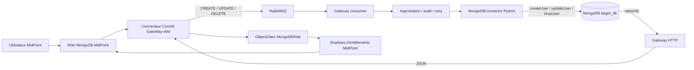

# Intégration technique de MongoDB dans Gateway IAM

## 1. Objet du document

Ce document explique comment MongoDB a été intégré, de bout en bout, dans
l'écosystème Gateway IAM. Il ne se limite pas au lancement des conteneurs : il
décrit les contrats de données, les composants modifiés, le rôle de chaque
fichier et l'ordre dans lequel reproduire l'intégration depuis une version du
projet qui ne connaît pas MongoDB.

Le résultat attendu est le suivant :

- MidPoint découvre les rôles de `target_db` comme des entitlements ;
- ces entitlements sont importés automatiquement comme shadows MidPoint ;
- l'affectation d'un rôle MidPoint produit une projection Gateway ;
- le connecteur ConnId publie l'opération dans RabbitMQ ;
- la Gateway crée un véritable utilisateur MongoDB avec `createUser` ;
- une modification utilise `updateUser` et une suppression `dropUser` ;
- le mot de passe défini dans MidPoint est transmis au compte MongoDB ;
- les opérations restent suivies par les mécanismes existants d'approbation,
  d'audit, de retry et de notification.

MongoDB n'est donc pas utilisé comme nouvelle base interne de Gateway IAM. Il
s'agit d'une **cible de provisionnement**, au même niveau que MySQL,
PostgreSQL, LDAP et Odoo.

## 2. Architecture finale



Deux flux coexistent :

1. le **flux de provisionnement**, de MidPoint vers MongoDB via RabbitMQ ;
2. le **flux de découverte**, de MongoDB vers MidPoint via Gateway HTTP et le
   connecteur ConnId.

L'intégration n'est complète que lorsque les deux flux fonctionnent.

## 3. Choix de conception

### 3.1 Créer des utilisateurs natifs MongoDB

Un compte provisionné est un utilisateur de base de données, créé dans
`target_db` :

```javascript
db.runCommand({
  createUser: "alice",
  pwd: "secret",
  roles: [{ role: "readWrite", db: "target_db" }]
})
```

Aucun document représentant l'utilisateur n'est inséré dans une collection
métier. Cette approche est cohérente avec les connecteurs SQL existants :
PostgreSQL crée un rôle `LOGIN`, MySQL crée un utilisateur natif, et MongoDB
crée un utilisateur natif.

### 3.2 Séparer le marqueur de service et les droits

Deux informations distinctes circulent dans le compte ConnId :

- `roles = ["mongodb"]` indique au consumer quelle cible doit être appelée ;
- `mongodbRoles = ["readWrite@target_db"]` indique les droits à attribuer.

Le marqueur `mongodb` ne doit jamais devenir un rôle MongoDB. Le connecteur
Python le filtre explicitement.

### 3.3 Identifier un entitlement par `role@database`

Un nom de rôle seul n'est pas unique dans MongoDB. Le même rôle peut exister
dans plusieurs bases. L'identifiant ConnId et le nom du shadow utilisent donc :

```text
readWrite@target_db
```

Cette valeur se décompose en :

```json
{
  "role": "readWrite",
  "db": "target_db"
}
```

### 3.4 Prévoir un mode dégradé pour les entitlements

Le reload d'une ressource MidPoint ne doit pas échouer si MongoDB est en cours
de redémarrage. Gateway HTTP interroge MongoDB dynamiquement, mais retourne une
liste statique minimale si la cible est momentanément indisponible.

## 4. Contrats de données introduits

### 4.1 Attributs du compte ConnId

| Attribut | Type | Usage |
| --- | --- | --- |
| `roles` | liste de chaînes | contient le marqueur `mongodb` |
| `mongodbRoles` | liste de chaînes | associations `role@database` |
| `mongodbDatabase` | chaîne | base dans laquelle créer le compte |
| `__PASSWORD__` | `GuardedString` ConnId | mot de passe venant de MidPoint |
| `password` | chaîne dans le message interne | forme normalisée consommée par la Gateway |

Exemple de message envoyé par le connecteur Java :

```json
{
  "operation": "CREATE",
  "entityType": "User",
  "uid": "8fb1a1de-98f3-445d-a306-cbaa57d95ac9",
  "attributes": {
    "username": "MongoDB_TEST",
    "email": "user@example.com",
    "password": "mot-de-passe-transmis-par-midpoint",
    "roles": ["mongodb"],
    "mongodbRoles": ["readWrite@target_db"],
    "mongodbDatabase": "target_db"
  }
}
```

### 4.2 Contrat de découverte des rôles

L'endpoint HTTP retourne une liste JSON :

```json
[
  {
    "roleName": "readWrite",
    "database": "target_db",
    "description": "Rôle MongoDB intégré"
  }
]
```

Le connecteur Java transforme chaque élément en objet ConnId `MongoDbRole`
avec :

- `__UID__ = readWrite@target_db` ;
- `__NAME__ = readWrite@target_db` ;
- `roleName = readWrite` ;
- `database = target_db` ;
- `description = Rôle MongoDB intégré`.

## 5. Étape 1 — déclarer MongoDB dans le domaine applicatif

### 5.1 Ajouter le service dans l'enum Python

Fichier : `app/utils/enums.py`

```python
class TargetService(str, Enum):
    MYSQL = "MYSQL"
    POSTGRESQL = "POSTGRESQL"
    MONGODB = "MONGODB"
    ODOO = "ODOO"
    LDAP = "LDAP"
```

Sans cette valeur, les messages `MONGODB` sont rejetés lors du parsing et les
opérations ne peuvent pas être persistées.

### 5.2 Mettre à jour l'enum Prisma

Fichier : `prisma/schema.prisma`

```prisma
enum TargetService {
  MYSQL
  POSTGRESQL
  MONGODB
  ODOO
  LDAP
}
```

Après modification du schéma, le client Prisma doit être régénéré lors du
build de l'image. L'image API exécute déjà `prisma generate`.

### 5.3 Ajouter le pilote Python

Fichier : `requirements.txt`

```text
pymongo>=4.6,<5
```

Le même pilote a été ajouté à `connector-dashboard/requirements.txt`. L'image
Gateway HTTP, plus légère et indépendante de l'image API, l'installe dans
`docker/Dockerfile.gateway-http`.

### 5.4 Déclarer la configuration

Fichiers :

- `app/config/settings.py` ;
- `.env.example` ;
- `ansible/roles/deploy/templates/env.docker.j2`.

Variables introduites :

```dotenv
MONGODB_HOST=mongodb-target
MONGODB_PORT=27017
MONGODB_USER=root
MONGODB_PASSWORD=mongodb_root_secret
MONGODB_DATABASE=target_db
MONGODB_AUTH_SOURCE=admin
MONGODB_CONNECT_TIMEOUT=10
```

`MONGODB_AUTH_SOURCE=admin` concerne le compte technique `root`. Les comptes
provisionnés, eux, sont créés et s'authentifient dans `target_db`.

## 6. Étape 2 — ajouter la cible Docker

### 6.1 Service MongoDB

Fichier : `docker-compose.yml`

Le service `mongodb-target` contient :

- l'image `mongo:7.0` ;
- le compte d'administration initial ;
- un volume persistant `mongodb_target_data` ;
- un healthcheck `mongosh` ;
- le profil Compose `targets` ;
- le réseau partagé `gateway-network`.

Extrait simplifié :

```yaml
mongodb-target:
  image: mongo:7.0
  container_name: gitivity-mongodb
  environment:
    MONGO_INITDB_ROOT_USERNAME: root
    MONGO_INITDB_ROOT_PASSWORD: mongodb_root_secret
    MONGO_INITDB_DATABASE: target_db
  ports:
    - "${SERVICE_BIND_IP:-10.10.0.1}:${MONGODB_TARGET_HOST_PORT:-27017}:27017"
  volumes:
    - mongodb_target_data:/data/db
  networks:
    - gateway-network
  profiles:
    - targets
```

MongoDB 7 a été retenu pour rester compatible avec le noyau Linux 6.19 du
poste de validation, sur lequel MongoDB 8 échouait au démarrage.

### 6.2 Distinguer port interne et port publié

`MONGODB_PORT=27017` est le port utilisé entre conteneurs. Le port publié sur le
VPS est indépendant :

```dotenv
MONGODB_TARGET_HOST_PORT=27018
```

Cette séparation a été ajoutée après la découverte d'une ancienne instance
MongoDB déjà liée à `10.10.0.1:27017`. La nouvelle cible Gitivity peut donc
être publiée sur `27018` sans modifier le code applicatif.

Le même principe a été appliqué à PostgreSQL avec
`POSTGRESQL_TARGET_HOST_PORT`, car `5433` était déjà utilisé sur le VPS.

### 6.3 Donner accès à Gateway HTTP

Le service `gateway-http` reçoit les variables MongoDB et partage le même
réseau que `mongodb-target`. Cette condition est essentielle : si MongoDB est
sain mais absent de `gateway-network`, `mongodb-target` ne peut pas être résolu
par DNS et l'endpoint retourne uniquement les rôles de secours.

## 7. Étape 3 — implémenter le connecteur Python

Fichier créé : `app/core/connectors/mongodb_connector.py`

La classe implémente le contrat `ProvisioningConnector` déjà utilisé par les
autres cibles.

### 7.1 Connexion asynchrone autour de PyMongo

PyMongo étant synchrone, les appels bloquants sont exécutés avec
`asyncio.to_thread` :

```python
self._client = MongoClient(
    host=settings.MONGODB_HOST,
    port=settings.MONGODB_PORT,
    username=settings.MONGODB_USER,
    password=settings.MONGODB_PASSWORD,
    authSource=settings.MONGODB_AUTH_SOURCE,
)
await asyncio.to_thread(self._client.admin.command, "ping")
```

Les méthodes `connect`, `disconnect` et `health_check` respectent ainsi
l'interface asynchrone de la Gateway sans bloquer sa boucle d'événements.

### 7.2 Normaliser les rôles

`_normalize_roles` accepte plusieurs formes :

```text
readWrite
readWrite@target_db
{"role": "readWrite", "db": "target_db"}
```

La méthode :

1. privilégie `attributes.mongodbRoles` ;
2. accepte l'ancien alias `mongodbRole` ;
3. utilise sinon la liste générique `roles` ;
4. retire les marqueurs `mongodb` et `mongo` ;
5. décompose `role@database` ;
6. supprime les doublons ;
7. applique `read` si aucun droit exploitable n'est fourni.

Le résultat correspond directement au format attendu par les commandes
MongoDB :

```python
[{"role": "readWrite", "db": "target_db"}]
```

### 7.3 Créer un utilisateur

`provision_user` :

1. refuse la création sans mot de passe ;
2. choisit `mongodbDatabase` ou la base configurée ;
3. vérifie l'existence avec `usersInfo` ;
4. transforme une création déjà effectuée en mise à jour ;
5. exécute `createUser` ;
6. conserve l'e-mail et l'OID MidPoint dans `customData`.

Commande produite :

```python
{
    "createUser": username,
    "pwd": password,
    "roles": mongo_roles,
    "customData": {
        "email": email,
        "midpointUid": midpoint_uid,
    },
}
```

L'identifiant de service retourné est `username@database`.

### 7.4 Modifier un utilisateur

`update_user` :

- crée le compte s'il est absent ;
- change le mot de passe uniquement lorsqu'un nouveau secret est fourni ;
- remplace les rôles avec `updateUser` lorsque `mongodbRoles` est présent ;
- met à jour `customData` lorsqu'il contient de nouvelles valeurs.

### 7.5 Supprimer un utilisateur

`delete_user` appelle `dropUser`. L'opération est idempotente : supprimer un
utilisateur déjà absent retourne un résultat réussi.

### 7.6 Traduire les erreurs

Les exceptions PyMongo deviennent des `ProvisioningError`. Les erreurs de
connexion et les opérations portant le label `RetryableWriteError` sont
marquées comme rejouables afin de réutiliser le mécanisme de retry existant.

## 8. Étape 4 — enregistrer le connecteur dans la Gateway

Fichiers :

- `app/core/connectors/__init__.py` ;
- `app/core/connectors/factory.py`.

Le factory contient désormais :

```python
TargetService.MONGODB: MongoDBConnector
```

Cette inscription permet à l'orchestrateur existant de sélectionner le
connecteur sans introduire de branche MongoDB dans le workflow générique.

## 9. Étape 5 — étendre le consumer RabbitMQ

Fichier : `app/core/broker/rabbitmq_consumer.py`

### 9.1 Reconnaître le service

Les alias ont été ajoutés à `ROLE_TO_SERVICE` :

```python
"mongodb": TargetService.MONGODB
"mongo": TargetService.MONGODB
```

Une construction MidPoint qui produit `roles = ["mongodb"]` déclenche donc une
opération `MONGODB`.

### 9.2 Lire les associations

Le consumer extrait `mongodbRoles`, convertit une valeur simple en liste et la
recopie dans `UserData.attributes`, avec `mongodbDatabase`.

### 9.3 Router les opérations

Pour une création ou une modification, les marqueurs contenus dans `roles`
sont traduits en services cibles. Pour une suppression :

- le cache des services précédemment provisionnés est consulté ;
- la présence de `mongodbRoles` ajoute explicitement MongoDB ;
- le fallback de suppression globale inclut désormais MongoDB.

La recherche Redis utilisée pour enrichir les suppressions sans attributs a
également été étendue à `MONGODB`.

### 9.4 Mot de passe de secours

Le comportement existant du consumer est conservé : si une création ne contient
aucun `password`, un secret aléatoire est généré. Ce fallback a permis de créer
les premiers comptes, mais il a aussi révélé un défaut de normalisation ConnId,
corrigé à l'étape 12.

## 10. Étape 6 — exposer la configuration et les outils annexes

### 10.1 API des connecteurs

Fichier : `app/api/v1/endpoints/connectors.py`

Les routes de lecture et de modification de configuration savent désormais
retourner ou changer : hôte, port, utilisateur, mot de passe, base et
`auth_source` MongoDB.

### 10.2 Notifications

Fichier : `app/services/email_templates.py`

Le label `mongodb` est traduit en `MongoDB` dans les e-mails d'approbation et de
confirmation.

### 10.3 Scripts de test et de diagnostic

Fichiers :

- `scripts/send_test_message.py` ;
- `scripts/check_provisioning.py` ;
- `tests/fixtures/sample_messages.json`.

Le générateur accepte `--service mongodb`, construit `mongodbDatabase` et
`mongodbRoles`, et une fixture `create_user_mongodb` fournit un message
reproductible. Le script de consultation accepte le filtre `MONGODB`.

## 11. Étape 7 — découvrir les rôles MongoDB

Fichiers :

- `gateway-http/gateway-http.py` ;
- `gateway-http/config.json` ;
- `docker/Dockerfile.gateway-http`.

### 11.1 Endpoint ajouté

```text
GET /entitlements/mongodb-roles
```

La fonction `get_mongodb_roles` :

1. ouvre une connexion d'administration ;
2. vérifie la cible avec `ping` ;
3. exécute `rolesInfo` dans `target_db` ;
4. demande les rôles intégrés avec `showBuiltinRoles` ;
5. filtre les résultats sur la base configurée ;
6. retourne le contrat JSON défini à la section 4.

Commande MongoDB utilisée :

```javascript
db.runCommand({
  rolesInfo: 1,
  showBuiltinRoles: true,
  showPrivileges: false
})
```

Sur l'environnement déployé, les rôles découverts sont :

- `dbAdmin@target_db` ;
- `dbOwner@target_db` ;
- `enableSharding@target_db` ;
- `read@target_db` ;
- `readWrite@target_db` ;
- `userAdmin@target_db`.

### 11.2 Fallback statique

`gateway-http/config.json` définit quatre rôles de secours : `read`,
`readWrite`, `dbAdmin` et `dbOwner`. Si MongoDB est indisponible, l'endpoint
reste en HTTP 200 et retourne cette liste.

Ce fallback garantit le chargement de la ressource, mais une importation faite
pendant le mode dégradé ne crée que quatre shadows. Il faut relancer l'import
après le retour de MongoDB pour récupérer toute la liste dynamique.

## 12. Étape 8 — étendre le connecteur ConnId Java

Répertoire : `midpoint-connector/`

### 12.1 Ajouter les attributs du compte

Fichier : `RestGatewayConnector.java`

Le schéma de `__ACCOUNT__` expose :

```java
mongodbRoles     // String, multi-valué
mongodbDatabase  // String
```

### 12.2 Définir l'ObjectClass d'entitlement

Une nouvelle classe ConnId `MongoDbRole` est déclarée avec :

- `Name.INFO` ;
- `roleName` ;
- `database` ;
- `description`.

MidPoint transforme ce type ConnId en classe de ressource :

```text
ri:CustomMongoDbRoleObjectClass
```

### 12.3 Appeler Gateway HTTP

Fichier : `RestGatewayClient.java`

La méthode `fetchMongoDbRoles` appelle
`/entitlements/mongodb-roles`, désérialise le tableau JSON et retourne une
liste vide en cas d'erreur HTTP.

### 12.4 Implémenter la recherche ConnId

Dans `executeQuery`, la branche `MongoDbRole` :

1. récupère les rôles HTTP ;
2. construit l'UID `roleName@database` ;
3. filtre éventuellement sur l'UID ou le nom demandé ;
4. construit un `ConnectorObject` par rôle ;
5. le transmet au `ResultsHandler`.

Le filtre sur `__NAME__` est important pour
`associationTargetSearch` : sans lui, une recherche de `readWrite@target_db`
pourrait retourner tous les rôles.

### 12.5 Corriger la transmission du mot de passe

Fichier : `JsonMapper.java`

ConnId nomme son attribut opérationnel `__PASSWORD__`. La Gateway attend la clé
`password`. Sans conversion, le consumer ne voit aucun secret et génère un mot
de passe aléatoire.

La correction normalise le nom avant la conversion du `GuardedString` :

```java
String mappedName = OperationalAttributes.PASSWORD_NAME.equals(name)
        ? "password"
        : name;
```

La même conversion est appliquée aux attributs de création et aux deltas de
modification.

Les tests utilisant un vrai `GuardedString` nécessitent
`connector-framework-internal` dans les dépendances de test de `build.gradle`.
Cette dépendance n'est pas embarquée dans le JAR de production.

## 13. Étape 9 — décrire MongoDB dans la ressource MidPoint

Fichier : `midpoint/ressource.xml`

### 13.1 Association sur le compte

L'ObjectType `account/default` reçoit une association :

```xml
<association>
    <ref>ri:mongodbRole</ref>
    <displayName>Rôle MongoDB</displayName>
    <kind>entitlement</kind>
    <intent>mongodbRole</intent>
    <direction>subjectToObject</direction>
    <associationAttribute>ri:mongodbRoles</associationAttribute>
    <valueAttribute>icfs:uid</valueAttribute>
</association>
```

Elle relie l'attribut multivalué du compte aux UID des shadows de rôles.

### 13.2 ObjectType d'entitlement

```xml
<objectType>
    <kind>entitlement</kind>
    <intent>mongodbRole</intent>
    <objectClass>ri:CustomMongoDbRoleObjectClass</objectClass>
    <!-- __NAME__, roleName, database, description -->
</objectType>
```

### 13.3 Namespace du bundle

Le namespace de `connectorConfiguration` et les scripts de déploiement ont été
alignés sur le nom réel du bundle Gradle :

```text
GateWay-IAM
```

Le JAR attendu est :

```text
GateWay-IAM-1.2.0-SNAPSHOT.jar
```

Un ancien nom de bundle ou de JAR empêche MidPoint d'associer la configuration
au connecteur chargé.

### 13.4 Reload et import ne sont pas la même opération

Le reload du schéma apprend à MidPoint que
`CustomMongoDbRoleObjectClass` existe. Il ne garantit pas que ses objets soient
déjà présents dans le repository.

- la vue **Resource** interroge la cible en direct ;
- la vue **Repository** lit les shadows importés ;
- l'opération REST `import/CustomMongoDbRoleObjectClass` synchronise les deux.

## 14. Étape 10 — créer les rôles MidPoint

Fichiers créés :

- `midpoint/roles/role-mongodb.xml` ;
- `midpoint/roles/role-gateway-mongodb-shadowref.xml` ;
- `midpoint/roles/role-gateway-mongodb-shadowref-admin.xml`.

### 14.1 Rôle direct

`role-mongodb.xml` construit un compte, produit le marqueur `mongodb` et écrit
directement `read@target_db` dans `mongodbRoles`.

### 14.2 Rôles basés sur les shadows

Les rôles ReadWrite et DbAdmin utilisent une association
`associationTargetSearch` :

```xml
<q:equal>
    <q:path>attributes/icfs:name</q:path>
    <q:value>readWrite@target_db</q:value>
</q:equal>
```

`searchStrategy=onResourceIfNeeded` permet de résoudre la cible même si le
shadow n'est pas encore présent localement, mais l'import automatique reste
préférable pour l'affichage et la sélection dans l'interface.

## 15. Étape 11 — automatiser le déploiement Ansible

### 15.1 Variables et environnement

Fichiers :

- `ansible/group_vars/all.yml` ;
- `ansible/roles/deploy/templates/env.docker.j2`.

Ajouts principaux :

- `mongodb_target_host_port` ;
- toutes les variables `MONGODB_*` ;
- présence de MongoDB dans la description du profil `with_targets`.

### 15.2 Attendre la disponibilité réelle

Fichier : `ansible/roles/wait_services/tasks/main.yml`

Lorsque `with_targets=true`, Ansible exécute un `ping` dans
`gitivity-mongodb` avec `mongosh`. La simple présence du conteneur n'est pas
considérée comme suffisante.

### 15.3 Construire et installer le JAR

Le rôle MidPoint :

1. lance Gradle ;
2. vérifie le JAR ;
3. le copie dans `/opt/midpoint/var/icf-connectors/` ;
4. redémarre le conteneur MidPoint géré ;
5. attend le retour de l'API ;
6. découvre l'OID réel du bundle ;
7. injecte cet OID dans la ressource.

Pour un MidPoint externe mais présent dans un conteneur sur le même VPS, les
variables nécessaires sont :

```text
midpoint_external=true
midpoint_manage_container=true
midpoint_container=midpointsetup-midpoint_server-1
```

### 15.4 Importer la ressource et les rôles

Le rôle tente un `POST`, puis effectue un `PUT` lorsque l'objet existe déjà. La
ressource et les rôles conservent des OID stables afin que le playbook puisse
être rejoué.

### 15.5 Importer automatiquement les entitlements

Après le déploiement du JAR, de la ressource et des rôles, Ansible appelle :

```text
POST /midpoint/ws/rest/resources/{resourceOid}/import/CustomMongoDbRoleObjectClass
```

MidPoint répond généralement `303 See Other` et fournit l'URL d'une tâche
asynchrone. Une tâche réussie doit présenter :

```text
executionState: closed
resultStatus: success
progress: nombre de rôles découverts
```

Le script `scripts/setup-all.sh` implémente la même étape pour un déploiement
sans Ansible. Ses constantes de bundle et de JAR ont également été corrigées.

## 16. Étape 12 — intégrer MongoDB au dashboard

Fichiers :

- `connector-dashboard/app.py` ;
- `connector-dashboard/templates/index.html` ;
- `connector-dashboard/requirements.txt`.

Les modifications couvrent :

- la connexion PyMongo ;
- la liste des utilisateurs avec `usersInfo` ;
- la génération des messages CREATE, UPDATE et DELETE ;
- la sélection multivaluée des rôles ;
- la génération de XML de rôle MidPoint ;
- l'onglet MongoDB et sa présentation visuelle.

Le dashboard produit le même contrat `mongodbRoles = role@database` que le
connecteur MidPoint.

## 17. Étape 13 — ajouter les tests

### 17.1 Tests unitaires Python

Fichier : `tests/unit/test_connectors.py`

Ils vérifient :

- l'enregistrement de MongoDB dans le factory ;
- le nom du service ;
- le parsing de `role@database` ;
- le filtrage du marqueur `mongodb` ;
- la suppression des doublons.

### 17.2 Test d'intégration MongoDB

Fichier : `tests/integration/test_mongodb_connector.py`

Le test réel :

1. se connecte avec le compte technique ;
2. crée un utilisateur avec `read` ;
3. vérifie sa présence avec `usersInfo` ;
4. s'authentifie avec le compte créé ;
5. remplace `read` par `readWrite` ;
6. vérifie le rôle final ;
7. supprime le compte ;
8. vérifie son absence et nettoie même en cas d'échec.

### 17.3 Tests Java

Fichiers :

- `RestGatewayConnectorTest.java` ;
- `JsonMapperTest.java`.

Ils vérifient l'ObjectClass `MongoDbRole`, les attributs de compte multivalués
et la conversion du mot de passe opérationnel en création et en modification.

### 17.4 Validations exécutées

La validation finale a couvert :

- 72 tests Python, dont le cycle réel MongoDB ;
- 15 tests Java après la correction du mot de passe ;
- compilation du JAR ;
- syntaxe Ansible ;
- rendu Docker Compose ;
- validité de tous les XML MidPoint ;
- syntaxe des scripts Bash ;
- lint Python ;
- endpoint dynamique et fallback ;
- import réel de 6 shadows dans MidPoint ;
- création d'un compte natif avec le rôle `readWrite`.

## 18. Séquence complète de reproduction

Pour refaire l'intégration sur une branche ne contenant pas MongoDB, respecter
cet ordre :

1. ajouter `MONGODB` aux enums Python et Prisma ;
2. ajouter PyMongo et les variables de configuration ;
3. créer `mongodb-target` dans Compose ;
4. implémenter `MongoDBConnector` ;
5. l'enregistrer dans le factory ;
6. étendre le parsing et le routage RabbitMQ ;
7. ajouter l'endpoint de découverte et son fallback ;
8. étendre le schéma ConnId Java ;
9. implémenter la recherche `MongoDbRole` ;
10. normaliser `__PASSWORD__` vers `password` ;
11. déclarer l'association et l'ObjectType dans la ressource ;
12. créer les rôles MidPoint ;
13. automatiser le build, le déploiement et l'import avec Ansible ;
14. étendre les scripts et le dashboard ;
15. exécuter les tests unitaires et le cycle réel ;
16. importer les shadows et tester une affectation depuis MidPoint.

Changer cet ordre crée des états intermédiaires trompeurs. Par exemple, un rôle
peut être visible via Gateway HTTP mais inutilisable tant que l'ObjectClass Java
et le schema handling MidPoint ne sont pas déployés.

## 19. Déploiement de référence sur le VPS

Commande utilisée, avec les ports adaptés aux services déjà présents :

```bash
cd ansible

ansible-playbook site.yml \
  -e "service_bind_ip=10.10.0.1" \
  -e "server_ip=10.10.0.1" \
  -e "postgresql_target_host_port=5435" \
  -e "mongodb_target_host_port=27018" \
  -e "midpoint_external=true" \
  -e "midpoint_host=10.10.0.1" \
  -e "midpoint_port=8080" \
  -e "midpoint_admin_user=administrator" \
  -e "midpoint_manage_container=true" \
  -e "midpoint_container=midpointsetup-midpoint_server-1" \
  -e "approval_mode=email" \
  -e "smtp_user=ADRESSE_SMTP" \
  -e "smtp_password=MOT_DE_PASSE_APPLICATION" \
  -e "with_targets=true"
```

Ne pas utiliser `skip_build` lors du premier déploiement d'une modification du
connecteur Java.

## 20. Vérifications fonctionnelles

### 20.1 Entitlements

```bash
curl http://10.10.0.1:5100/entitlements/mongodb-roles
```

Le résultat dynamique doit contenir six rôles sur l'environnement actuel.

Dans MidPoint :

```text
Resources → gateway-iam → Entitlements → mongodbRole → Repository
```

### 20.2 Compte provisionné

```bash
docker exec gitivity-mongodb mongosh \
  --quiet \
  --username root \
  --password mongodb_root_secret \
  --authenticationDatabase admin \
  target_db \
  --eval 'db.runCommand({usersInfo: "MongoDB_TEST", showPrivileges: true})'
```

### 20.3 Authentification du compte

```bash
docker exec gitivity-mongodb mongosh \
  --host localhost \
  --port 27017 \
  --username MongoDB_TEST \
  --password 'MOT_DE_PASSE_DU_COMPTE' \
  --authenticationDatabase target_db \
  target_db \
  --eval 'db.runCommand({connectionStatus: 1})'
```

Le port est `27017` dans le conteneur même si le VPS publie la cible sur
`27018`.

## 21. Incidents rencontrés et enseignements

### 21.1 Seulement quatre entitlements dans MidPoint

Cause observée : `gitivity-mongodb` était sain mais n'était pas attaché au
réseau de la Gateway après un conflit de port. Gateway HTTP ne résolvait pas
`mongodb-target` et retournait les quatre rôles de secours.

Diagnostic :

```bash
docker logs gitivity-http
docker network inspect gitivity_gateway-network
curl http://10.10.0.1:5100/entitlements/mongodb-roles
```

Correction : résoudre le conflit de port, recréer le conteneur sur le bon
réseau, vérifier les six rôles dynamiques, puis relancer l'import MidPoint.

### 21.2 Authentification impossible avec le mot de passe MidPoint

Cause observée : le message contenait `__PASSWORD__` alors que le consumer
lisait `password`. Un secret aléatoire était généré et le compte existait avec
un mot de passe différent.

Correction : normalisation dans `JsonMapper`, tests avec `GuardedString`, rebuild
et redéploiement du JAR. Les comptes créés avant la correction ne sont pas
modifiés rétroactivement.

### 21.3 Collision avec des services historiques

Le VPS possédait déjà :

- un PostgreSQL sur `5433` ;
- un MongoDB sur `27017`.

Les variables de ports publiés ont été introduites afin de conserver ces
services. Arrêter les anciens conteneurs n'était ni nécessaire ni souhaitable.

### 21.4 Différence entre `admin` et `target_db`

Le compte technique `root` s'authentifie avec `authSource=admin`. Un utilisateur
créé par la Gateway appartient à `target_db` et doit utiliser
`authenticationDatabase=target_db`.

## 22. Inventaire des fichiers concernés

| Couche | Fichiers principaux |
| --- | --- |
| Domaine | `app/utils/enums.py`, `prisma/schema.prisma` |
| Configuration | `app/config/settings.py`, `.env.example`, `requirements.txt` |
| Connecteur Python | `app/core/connectors/mongodb_connector.py`, `factory.py`, `__init__.py` |
| Messaging | `app/core/broker/rabbitmq_consumer.py` |
| API et notifications | `app/api/v1/endpoints/connectors.py`, `app/services/email_templates.py` |
| Découverte | `gateway-http/gateway-http.py`, `gateway-http/config.json`, `docker/Dockerfile.gateway-http` |
| ConnId Java | `RestGatewayConnector.java`, `RestGatewayClient.java`, `JsonMapper.java`, `build.gradle` |
| Ressource MidPoint | `midpoint/ressource.xml` |
| Rôles MidPoint | `midpoint/roles/role-mongodb.xml`, `role-gateway-mongodb-shadowref.xml`, `role-gateway-mongodb-shadowref-admin.xml` |
| Conteneurs | `docker-compose.yml` |
| Ansible | `ansible/group_vars/all.yml`, `env.docker.j2`, rôles `wait_services` et `midpoint` |
| Scripts | `scripts/setup-all.sh`, `scripts/setup-midpoint.sh`, `scripts/send_test_message.py`, `scripts/check_provisioning.py` |
| Dashboard | `connector-dashboard/app.py`, `templates/index.html`, `requirements.txt` |
| Tests | `tests/unit/test_connectors.py`, `tests/integration/test_mongodb_connector.py`, tests Java, fixtures JSON |
| Documentation générale | `README.md`, `bdd-fiche.txt` |

Cet inventaire permet de vérifier qu'une future cible de base de données est
intégrée dans toutes les couches et pas uniquement dans son connecteur runtime.
